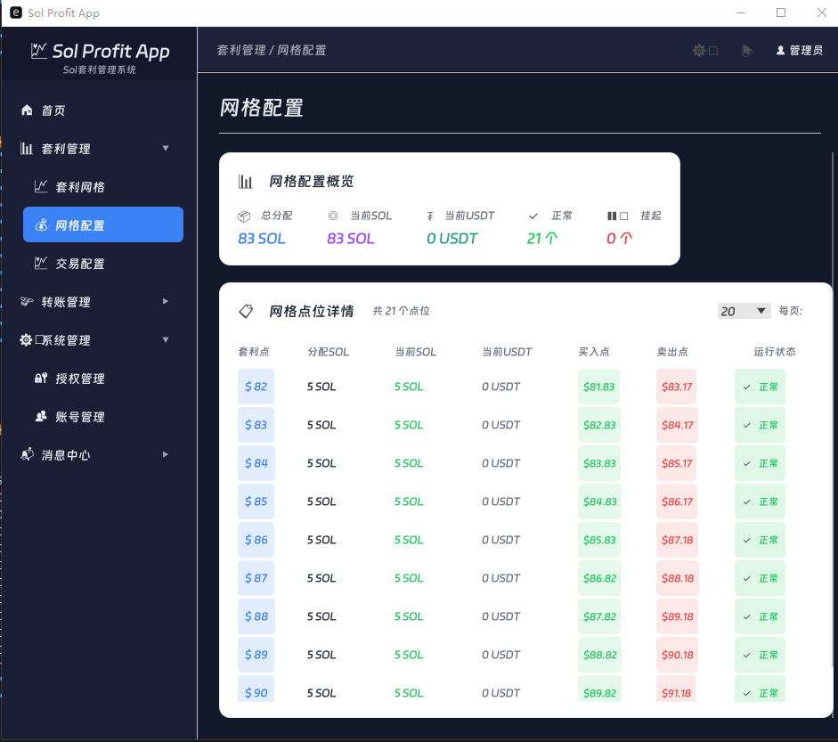
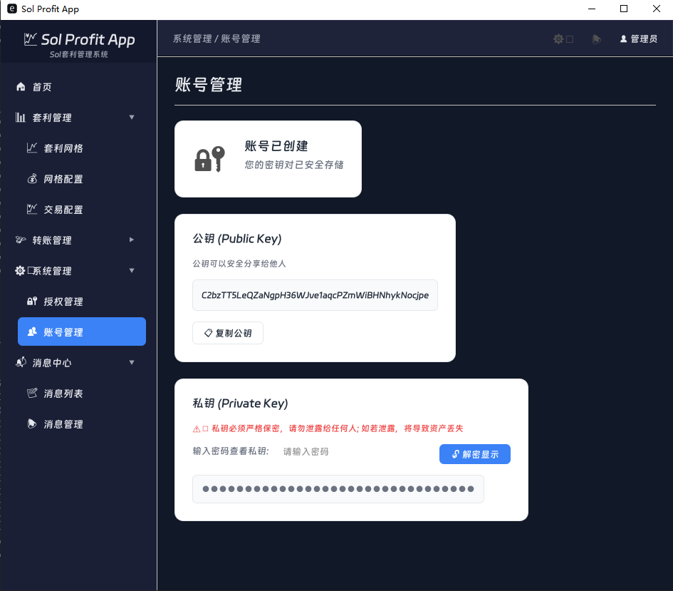

<h1 align="center">
  
   
  SOL 套 利 系 统</a>
</h1>

## 简 介
- **SolProfitApp让SOL在波动中自动赚钱, 专为Solana生态打造的自动化网格套利工具，无需盯盘、无需手动操作，7✖24小时自动执行低买高卖策略。**
- **SolProfitApp帮你把交易策略自动化。只需设定价格区间和网格参数，系统就会在SOL价格波动中自动完成买卖，把每一次震荡都转化为收益机会。**
- **无论是量化交易者还是普通持币用户，都可以通过简洁的可视化界面，快速上手并实时监控账户状态。**
## 预 览
| 配 置                             | 账 号                             |
| -------------------------------- | --------------------------------- |
|  |  |
## 指 导 视 频
- [ 安 装 过 程 ](https://www.youtube.com/watch?v=uWgWAdm_Qu8)
- [ 配 置 套 利 ](https://github.com/zhangkit64-hash/profit)
- [ 配 置 账 号 ](https://github.com/zhangkit64-hash/profit)
- [ 授 权 管 理 ](https://github.com/zhangkit64-hash/profit)
- [ 消 息 管 理](https://github.com/zhangkit64-hash/profit)
